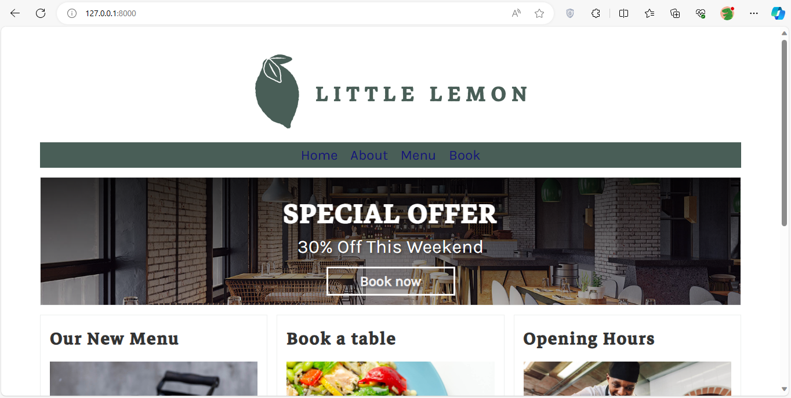
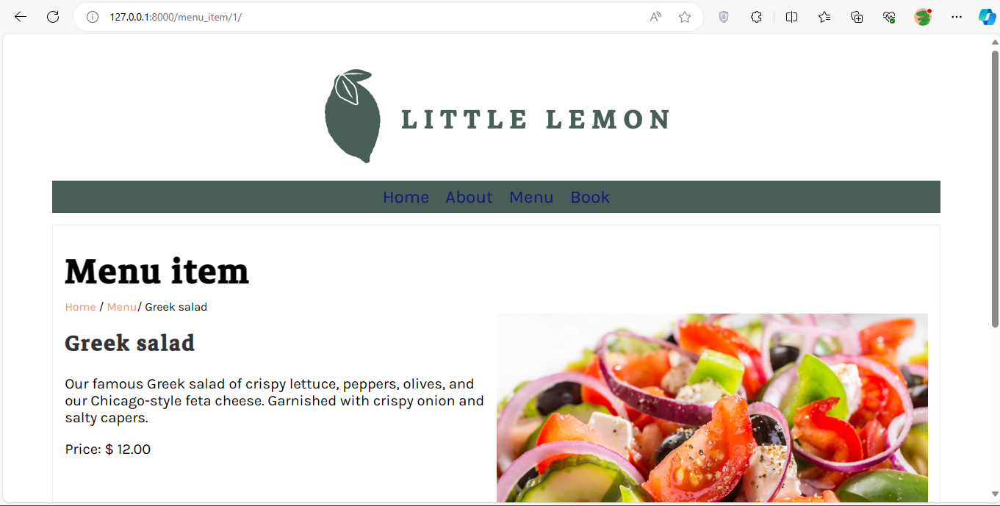
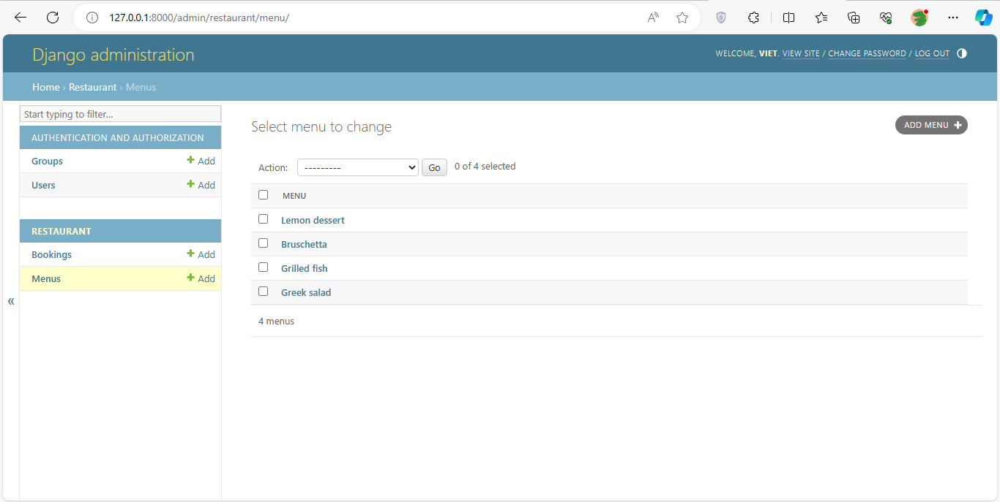

# Little-Lemon
# H1 This is a project which I learnt from Meta Back-end developer professional certificate on Coursera platform.
This project is a restaurant's website, it's supports some action like Booking table, View menu's item, and Manage the menu.

---     

